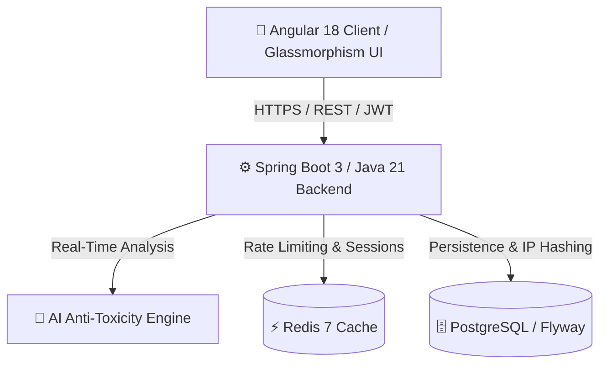

<div align="center">

# Whispr. 🤫
### The next-generation AI-powered, secure, and anonymous messaging web platform.

[](README.md)
[](README.en.md)
[](./frontend)
[](./backend)
[]()

[🇬🇧 Read in English](./README.en.md) | [🇫🇷 Lire en Français](./README.md)

</div>

---

## 💡 Why the Name "Whispr"?

The name **Whispr** (derived from the word *whisper*) was chosen with deep intentionality. It embodies the very core of our vision for digital communication and social engagement:

1. **Intimacy and Trust**: A whisper is reserved for secrets, personal confessions, and authenticity. In a noisy digital landscape where mainstream social networks incentivize public performativity and superficial engagement, Whispr recreates an intimate, private sanctuary where individuals can speak their truth without fear of public judgment.
2. **Closeness Without Toxicity**: Whispering into someone's ear implies closeness and care. Our name serves as a constant reminder of our foundational commitment: providing absolute freedom of expression while rigorously safeguarding our users against digital harassment, bullying, and malice.
3. **A Viral Curiosity Engine**: The mystery surrounding a whispered secret naturally sparks curiosity. This psychological lever drives users to share their personal secret link across their Instagram Bios, TikTok profiles, and Snapchat Stories to discover what their friends truly think of them.

---

## 🚀 Our Value Proposition & Competitive Edge (vs. NGL, Tellonym, Sarahah...)

Anonymous messaging applications (such as *NGL*, *Tellonym*, *Yolo*, *Sarahah*, or *Sendit*) have historically achieved explosive viral growth, yet they all suffer from a **fatal structural flaw**: rampant cyberbullying, hate speech, and poor data privacy, frequently resulting in App Store bans and mass user churn.

**Whispr reinvents the genre by transforming these historical weaknesses into a decisive competitive advantage:**

| Feature | Competitor Apps (NGL, Tellonym...) | **Whispr (Our Solution)** 🚀 |
| :--- | :--- | :--- |
| **🛡️ Moderation & Security** | **Reactive & Basic**: Easily bypassed keyword blocklists, post-report manual moderation. High exposure to digital harassment. | **Proactive Real-Time AI (< 2s)**: Every message is analyzed by an advanced AI engine before reaching the recipient's inbox. Toxic and hateful content is neutralized at the source. |
| **🔒 Privacy & GDPR** | **Plaintext IP Storage**: Risky IP logging, data monetization, and controversial paid "hint reveal" features that compromise sender anonymity. | **Absolute Cryptographic Anonymity**: Systematic cryptographic hashing and pseudonymization by default. No IP addresses are stored in plaintext. 100% GDPR compliant with anti-stalking protection. |
| **🎨 UI/UX Experience** | **Basic MVP Design**: Simplistic, static interfaces that quickly lose user engagement once the initial novelty fades. | **Premium Glassmorphism Design System**: Sleek dark mode, fluid micro-animations, dynamic unread badges, and instant visual feedback without intrusive browser alerts. |
| **📈 Viral Growth Loops** | **Passive Acquisition**: Relying entirely on users independently deciding to download the app after answering a prompt. | **Integrated Acquisition Loop**: Engaging visual prompts ("It's your turn!") displayed immediately after sending a message, converting visitors into newly registered users in 10 seconds. |
| **🏗️ Scalability & Reliability** | Fragile backend scripts prone to crashes, latency spikes, and downtime during viral traffic surges. | **High-Performance Enterprise Architecture**: Built on Java 21, Spring Boot 3, Angular 18, PostgreSQL, and Redis cache (Rate-limiting & DDoS protection). Engineered to handle millions of requests. |

---

## 🛠️ Technical Stack & Architecture

Built with cutting-edge, enterprise-grade technologies to guarantee security, speed, and maintainability:



- **Frontend**: [Angular 18](./frontend) (TypeScript, Reactive Signals, Router, Jest testing suite).
- **Backend**: [Spring Boot 3 / Java 21](./backend) (Spring Security OAuth2/JWT, Spring Data JPA, RESTful API).
- **Database**: PostgreSQL with automated schema migrations via Flyway.
- **Cache & Security**: Redis for Rate-Limiting (anti-spam / anti-DDoS protection) and token management.
- **Containerization**: Docker & Docker Compose for seamless local development in a single command.

---

## 🏗️ Monorepo Structure

```text
whispr/
├── backend/                # Spring Boot 3 / Java 21 REST API
│   ├── src/main/java/      # Business logic, JWT security, AI services
│   └── README.md           # Backend-specific documentation
├── frontend/               # Angular 18 Web Application
│   ├── src/app/features/   # Modules: Home, Auth, Inbox, Public-Profile, Admin
│   └── README.md           # Frontend-specific documentation
└── docker-compose.yml      # Local development infrastructure (PostgreSQL + Redis)
```

---

## ⚡ Quick Start (Local Development)

Launch the complete full-stack environment on your local machine in under 2 minutes:

### 1. Prerequisites
- [Docker & Docker Compose](https://www.docker.com/) installed and running.
- [Node.js 18+](https://nodejs.org/) and Angular CLI (`npm i -g @angular/cli`).
- [JDK 21](https://adoptium.net/) and Maven.

### 2. Start Infrastructure (Database & Cache)
From the root directory, spin up the Docker containers:
```bash
docker-compose up -d
```
*PostgreSQL will be available on port `5432` and Redis on port `6379`.*

### 3. Launch Backend API
```bash
cd backend
./mvnw clean spring-boot:run
```
*The REST API will start on `http://localhost:8081`.*

### 4. Launch Frontend Web App
Open a new terminal window and run:
```bash
cd frontend
npm install
npm start
```
*The web application will be live at **`http://localhost:4200`**.*

---

## 👑 Demo Accounts & Roles

Test the private inbox and admin dashboard immediately:
- **Demo User (Inbox)**: `demo@whispr.com` / `password123`
- **Administrator (Admin Dashboard)**: `admin@whispr.com` / `admin123`
- **Public Demo Profile**: [http://localhost:4200/demo](http://localhost:4200/demo)

---

<div align="center">
  <p>Engineered with passion to unite total freedom of expression with proactive digital safety.</p>
  <p><b>© 2026 Whispr Team. All rights reserved.</b></p>
</div>
