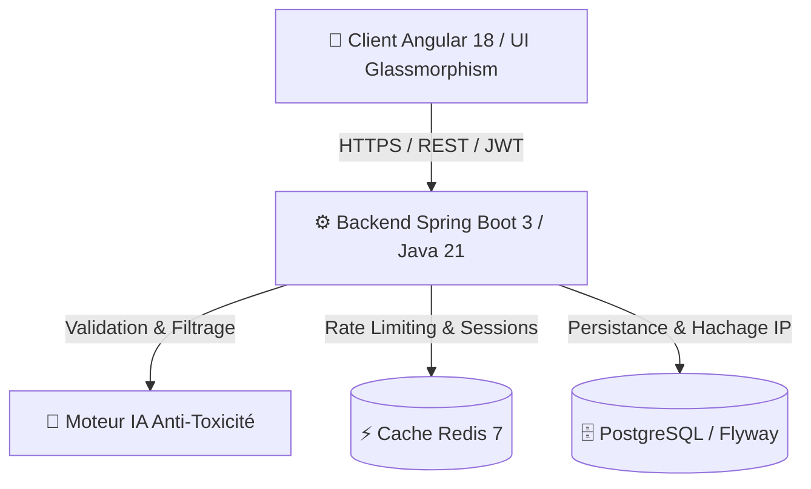

<div align="center">

# Whispr. 🤫
### La plateforme web de messages secrets de nouvelle génération, sécurisée et propulsée par l'IA.

[](README.md)
[](README.en.md)
[](./frontend)
[](./backend)
[]()

[🇬🇧 Read in English](./README.en.md) | [🇫🇷 Lire en Français](./README.md)

</div>

---

## 💡 Pourquoi le nom "Whispr" ?

Le nom **Whispr** (dérivé de *whisper*, « chuchoter » en anglais) n'a pas été choisi au hasard. Il incarne l'essence même de notre vision du réseau social et de la communication digitale :

1. **L'Intimité et la Confiance** : Un chuchotement est réservé aux secrets, aux confidences, à l'authenticité. Dans un univers numérique bruyant où les réseaux sociaux traditionnels poussent à la mise en scène publique et superficielle, Whispr recrée un espace intimiste où la parole est libérée de la peur du jugement public.
2. **La Proximité sans Malveillance** : Chuchoter à l'oreille de quelqu'un implique de la proximité et de la bienveillance. Notre nom rappelle constamment notre engagement fondamental : offrir un espace de liberté d'expression totale tout en protégeant nos utilisateurs contre la malveillance et le cyberharcèlement.
3. **Un Moteur de Curiosité Virale** : Le "mystère" entourant un chuchotement suscite naturellement la curiosité. C'est ce levier psychologique qui incite les utilisateurs à partager leur lien secret sur leurs bios Instagram, TikTok ou Snapchat pour découvrir ce que leurs amis pensent réellement d'eux.

---

## 🚀 La Plus-Value & l'Avantage Concurrentiel (Face à NGL, Tellonym, Sarahah...)

Les applications de messages anonymes (comme *NGL*, *Tellonym*, *Yolo*, *Sarahah* ou *Sendit*) ont historiquement connu d'immenses succès viraux, mais elles souffrent toutes d'un **talon d'Achille structurel** : le cyberharcèlement, la toxicité et le manque de protection des données, qui conduisent fréquemment à des interdictions sur l'App Store ou à un abandon des utilisateurs.

**Whispr réinvente le genre en transformant ces faiblesses en un avantage concurrentiel décisif :**

| Critère | Applications Concurrentes (NGL, Tellonym...) | **Whispr (Notre Solution)** 🚀 |
| :--- | :--- | :--- |
| **🛡️ Modération & Sécurité** | **Réactive et basique** : Listes de mots-clés facilement contournables, modération après signalement. Forte exposition au harcèlement. | **Proactive par IA (Temps Réel < 2s)** : Chaque message est analysé avant d'atteindre l'inbox par un moteur d'intelligence artificielle. Le contenu haineux ou toxique est neutralisé à la source. |
| **🔒 Vie Privée & RGPD** | **Adresses IP en clair** : Stockage risqué des IP, revente de données ou fonctionnalités controversées de "révélation d'indice" payantes violant l'anonymat. | **Anonymat Cryptographique Absolu** : Hachage cryptographique et pseudonymisation systématisée par défaut. Aucune IP n'est stockée en clair. Respect total du RGPD et protection anti-stalking. |
| **🎨 Expérience UI/UX** | **Design basique (MVP)** : Interfaces souvent simplistes, statiques et peu engageantes une fois la nouveauté passée. | **Design System Premium (Glassmorphism)** : Mode sombre élégant, animations fluides, badges dynamiques pour les messages non lus et retours visuels immédiats sans alertes intrusives. |
| **📈 Boucles Virales** | **Acquisition passive** : L'utilisateur doit décider de lui-même de télécharger l'application après avoir répondu. | **Acquisition Intégrée (Viral Growth Loop)** : Incitation visuelle engageante ("C'est à votre tour !") affichée immédiatement après l'envoi d'un message pour convertir chaque visiteur en nouvel utilisateur en 10 secondes. |
| **🏗️ Fiabilité & Scalabilité** | Infrastructure souvent fragile lors des pics de viralité, lenteurs et pannes fréquentes. | **Architecture Entreprise Haute Performance** : Java 21, Spring Boot 3, Angular 18, PostgreSQL et cache Redis (Rate-limiting anti-DDoS). Conçu pour supporter des millions de requêtes. |

---

## 🛠️ Stack Technique & Architecture

Le projet repose sur des technologies de pointe garantissant robustesse, maintenabilité et sécurité :



- **Frontend** : [Angular 18](./frontend) (TypeScript, Signals, Routage, Jest pour les tests).
- **Backend** : [Spring Boot 3 / Java 21](./backend) (Spring Security OAuth2/JWT, Spring Data JPA, API REST).
- **Base de données** : PostgreSQL avec gestion des migrations via Flyway.
- **Cache & Sécurité** : Redis pour le Rate-Limiting (protection anti-spam/DDoS) et la gestion des tokens.
- **Conteneurisation** : Docker & Docker Compose pour un déploiement local en une seule commande.

---

## 🏗️ Architecture du Dépôt (Monorepo)

```text
whispr/
├── backend/                # API REST Spring Boot 3 / Java 21
│   ├── src/main/java/      # Logique métier, sécurité JWT, services IA
│   └── README.md           # Documentation spécifique au Backend
├── frontend/               # Client Web Angular 18
│   ├── src/app/features/   # Modules : Home, Auth, Inbox, Public-Profile, Admin
│   └── README.md           # Documentation spécifique au Frontend
└── docker-compose.yml      # Infrastructure locale (PostgreSQL + Redis)
```

---

## ⚡ Lancement Rapide en Local

Pour démarrer l'environnement complet sur votre machine en moins de 2 minutes :

### 1. Prérequis
- [Docker & Docker Compose](https://www.docker.com/) installés.
- [Node.js 18+](https://nodejs.org/) et Angular CLI (`npm i -g @angular/cli`).
- [JDK 21](https://adoptium.net/) et Maven.

### 2. Démarrage de l'infrastructure (Base de données & Cache)
À la racine du projet, lancez les conteneurs Docker :
```bash
docker-compose up -d
```
*PostgreSQL sera accessible sur le port `5432` et Redis sur le port `6379`.*

### 3. Lancement du Backend (API)
```bash
cd backend
./mvnw clean spring-boot:run
```
*L'API REST démarrera sur `http://localhost:8081`.*

### 4. Lancement du Frontend (Web App)
Ouvrez un nouveau terminal et lancez :
```bash
cd frontend
npm install
npm start
```
*L'application web sera disponible sur **`http://localhost:4200`**.*

---

## 👑 Comptes et Rôles de Démonstration

Pour tester immédiatement la boîte de réception et le panneau d'administration :
- **Utilisateur Démo (Inbox)** : `demo@whispr.com` / `password123`
- **Administrateur (Panneau Admin)** : `admin@whispr.com` / `admin123`
- **Profil Public de Démo** : [http://localhost:4200/demo](http://localhost:4200/demo)

---

<div align="center">
  <p>Conçu avec passion pour allier liberté d'expression et sécurité bienveillante.</p>
  <p><b>© 2026 Whispr Team. Tous droits réservés.</b></p>
</div>
